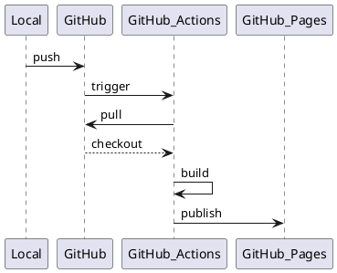

# sphinx-plantuml-github-pages-template

## About

A set of template scripts to develop document with sphinx and publish it to GitHub Pages using GitHub Actions.

Folder structure and config file were generated with `sphinx-quickstart` command described in <https://www.sphinx-doc.org/en/master/usage/quickstart.html>

## Getting Started

### Prerequisite

- For Local Development
  - python 3.9
  - pipenv
  - Graphviz

- To Update GitHub Actions
  - A Repo with GitHub Pages enabled with GitHub Actions Trigger
    - <https://pages.github.com/>
    - <https://github.com/features/actions>

  - A GitHub credential which includes workflow scope

### Start Documentation

```sh
# install dependencies
$ cd docs
$ pipenv install

# activate virtualenv
$ pipenv shell

# auto build and reload
# can check latest document on http://127.0.0.1:8000 with browser
$ sphinx-autobuild source build/html
```

### Publish Document

Document push to the origin will trigger workflow described below.

