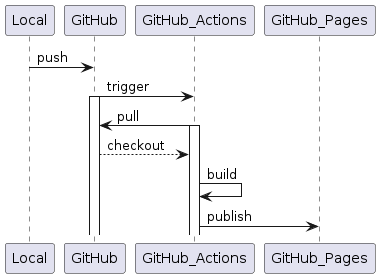
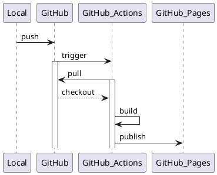

# sphinx-plantuml-github-pages-template

## About

A set of template scripts to develop document with [Sphinx](https://www.sphinx-doc.org/) and [PlantUML](https://plantuml.com/) and then publish it to [GitHub Pages](https://pages.github.com/) using [GitHub Actions](https://github.com/features/actions).

Folder structure and config file were generated with `sphinx-quickstart` command described in [here](https://www.sphinx-doc.org/en/master/usage/quickstart.html).

## Getting Started

### Prerequisites

- For Local Development

  - python 3.9.13

    - via pyenv

      - for Windows

        - <https://github.com/pyenv-win/pyenv-win>

        ```powershell
        # with admin privilege
        set-executionpolicy remotesigned

        # with user privilege
        Invoke-WebRequest -UseBasicParsing -Uri "https://raw.githubusercontent.com/pyenv-win/pyenv-win/master/pyenv-win/install-pyenv-win.ps1" -OutFile "./install-pyenv-win.ps1"; &"./install-pyenv-win.ps1"

        # close powershell and and reopen
        pyenv --version
        pyenv install 3.9.13

        # install pipenv to 3.9.13
        cd docs && pip install pipenv
        ```

      - for linux
        - <https://github.com/pyenv/pyenv>

  - pipenv

    ```sh
    cd docs && pip install pipenv
    ```

  - PlantUML environment
    - <https://plantuml.com/starting>
    - Java Runtime
    - Graphviz
      - <https://graphviz.org/>

- For UML diagram writing

  - Recommend to use VSCode + PlantUML plugin.
    - https://marketplace.visualstudio.com/items?itemName=jebbs.plantuml

- To Publish Page to GitHub Pages with GitHub Actions
  - A Repo with GitHub Pages enabled with GitHub Actions Trigger
  - A GitHub credential which includes workflow scope

### Folder Structure

```txt
sphinx-plantuml-github-pages-template
├ .github
│  └ workflows  # Folder for github actions definition
│     └ github-actions-sphinx.yml
└　docs
  ├ build       # Folder for build document
  ├ source      # Folder for document source
  ├ conf.py     # Configuration file for the Sphinx documentation builder
  └ index.rst   # Top level document contains Table Of Contents (TOC) information

```

### Start Documentation

```sh
# install dependencies
$ cd docs && pipenv install

# auto build and reload
# can check latest document on http://127.0.0.1:8000 with browser
$ cd docs && pipenv run sphinx-autobuild source build/html
```

### Publish Document

Document push to the origin will trigger workflow described below.

Published document can be found at <https://ryotaimc.github.io/sphinx-plantuml-github-pages-template/>




